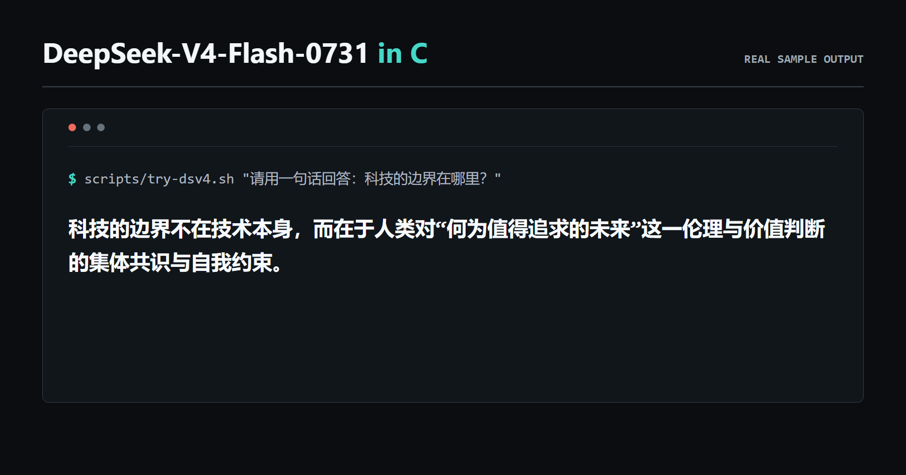

<h1 align="center">DeepSeek-V4-Flash-0731 纯 C CPU 推理引擎</h1>

<p align="center">
  <strong>在笔记本单颗 CPU 上本地运行 DeepSeek-V4-Flash-0731 原生权重。</strong><br>
  既可以在终端聊天，也可以通过模型常驻的本地 OpenAI 兼容接口接入应用。<br>
  一个用纯 C 语言（C99）编写的本地大模型 MoE 推理引擎，无需 GPU、CUDA、PyTorch，也无需转换权重。
</p>

<table align="center">
  <tr>
    <td align="center"><strong>284B-A13B</strong><br>参数量</td>
    <td align="center"><strong>8 GB</strong><br>最低 CPU内存可运行</td>
    <td align="center"><strong>0.892 s/token</strong><br>32 GB内存x86机器的最优 TPOT<br>1.12 token/s</td>
  </tr>
</table>

<p align="center">
  <a href="https://github.com/shyringo/deepseek-v4-flash-0731-in-c/actions/workflows/dsv4-ci.yml"></a>
  <a href="https://github.com/shyringo/deepseek-v4-flash-0731-in-c/releases"></a>
  <a href="LICENSE"></a>
</p>

<p align="center">
  <a href="README.md">English</a> | <a href="README.zh-CN.md">简体中文</a><br>
  <a href="#快速开始"><strong>快速开始</strong></a> ·
  <a href="#本地-api">本地 API</a> ·
  <a href="#实测性能">实测性能</a> ·
  <a href="#我们项目所实现的推理优化">推理优化</a>
</p>

## 快速开始

需要主流 64 位 CPU（x86-64、ARM64 等）、提供 POSIX 接口的系统环境、至少
8 GB CPU内存，以及约 172 GB 磁盘空间。Windows 请使用 WSL2。

首次构建前，请用当前系统的包管理器安装 C99 编译器、make、OpenMP、Git、
curl 和 Bash。以 Ubuntu/WSL2 与 macOS 为例：

```bash
# Ubuntu / WSL2
sudo apt-get update
sudo apt-get install -y build-essential git curl

# macOS（需要先安装 Homebrew）
xcode-select --install
brew install libomp
```

然后在同一个终端中运行：

```bash
# 获取并构建项目
git clone https://github.com/shyringo/deepseek-v4-flash-0731-in-c.git
cd deepseek-v4-flash-0731-in-c
make -j

# 从 ModelScope 下载并自动校验完整权重（约 166.9 GB，支持断点续传）
scripts/download-dsv4.sh "$HOME/model/DeepSeek-V4-Flash-0731"

# 启动常驻聊天
scripts/try-dsv4.sh
```

启动后直接输入消息即可。脚本会根据当前内存和 CPU 自动决定上下文长度、缓存
大小、线程数和读盘方式。输入 `/reset` 开始新会话，按 `Ctrl-C` 停止当前回答
但保留模型，输入 `/exit` 退出。

<p align="center">
  
</p>

常用的其他推理方式：

```bash
# 单次提问，回答结束后退出
scripts/try-dsv4.sh "科技的边界在哪里？"

# 内存足够时，给模型和缓存明确分配 18 GiB 总内存
DSV4_MEMORY_GIB=18 scripts/try-dsv4.sh

# 直接使用二进制，明确指定生成长度
bin/dsv4 --model "$HOME/model/DeepSeek-V4-Flash-0731" \
  --prompt "科技的边界在哪里？" --max-tokens 64

# 直接使用二进制启动常驻聊天
bin/dsv4 --model "$HOME/model/DeepSeek-V4-Flash-0731" --interactive

# 查看采样、思考模式、系统提示词等全部选项
bin/dsv4 --help
```

### 本地 API

让模型和专家缓存保持加载，并启动一个仅限本机访问的 OpenAI 兼容接口：

```bash
scripts/try-dsv4.sh --server 8080
```

在另一个终端或本地应用中调用：

```bash
curl http://127.0.0.1:8080/v1/chat/completions \
  -H "Content-Type: application/json" \
  -d '{"model":"deepseek-v4-flash-0731-in-c","messages":[{"role":"user","content":"科技的边界在哪里？"}],"stream":true}'
```

接口地址填写 `http://127.0.0.1:8080/v1`，无需 API Key。每次请求都提交完整
对话，但 167 GB 权重和运行时缓存会一直保持加载；接口也支持经过校验的函数
工具调用和并行工具结果。支持的参数、流式调用方式和当前限制见
[本地 API](docs/API.zh-CN.md)。

## 环境要求

- **CPU与系统：** 主流 64 位 CPU（x86-64、ARM64 等），以及支持 POSIX
  `mmap`、`pread` 和 pthread 的系统环境。Windows 请使用 WSL2。
- **CPU内存：** 最低 8 GB；更多内存可以容纳更大的专家缓存。
- **磁盘：** 至少约 172 GB 空闲空间，用于 48 个原生权重分片及余量。
- **工具：** C99 编译器、make、OpenMP、Git、curl、Bash，以及 `sha256sum`
  或 `shasum`。

默认会自动选择内存方案。更多内存只有在不引起系统换页时才会更快。

## 实测性能

TTFT 是提交消息到首个 token 可见的时间；TPOT 是首个 token 之后，剩余
`N-1` 个输出 token 的平均间隔。这里的 TTFT 从模型已打开、准备开始 prefill
时计时，到首个 token 写入终端为止；模型文件打开和 tokenizer 初始化计入总
耗时，但不计入 TTFT。生成内容会逐 token 立即显示。

下表只列完成了对应 workload、输出通过正确性检查的最佳有效记录，不把不同
推理测试的数据拼接成一个结果：

| 场景 | 输入 / 输出 token | 内存方案 | TTFT | TPOT | 吞吐 | 专家读取 | 最高内存占用 |
|---|---:|---:|---:|---:|---:|---:|---:|
| 普通回答，没有找到可复用文本 | 5 / 64 | 18 GiB | 20.203 s | 1.705 s/token | 0.59 token/s | 70.67 GiB | 21.95 GiB |
| 同一普通回答，降低内存预算 | 5 / 64 | 15 GiB | 20.560 s | 1.791 s/token | 0.56 token/s | 77.84 GiB | 18.95 GiB |
| 完整重复内容续写，Prompt lookup 命中 | 10 / 60 | 18 GiB | 26.748 s | **0.892 s/token** | **1.12 token/s** | 53.64 GiB | 22.19 GiB |

如果你使用了不同硬件，欢迎[提交一份可复现的性能结果](https://github.com/shyringo/deepseek-v4-flash-0731-in-c/issues/new?template=benchmark_result.yml)。

0.892 s/token 是完整生成 20 行、共 60 个 token 后得到的最好结果。4 轮主模型
验证接受了 50/51 个 draft token；所有文本均由主模型确认，猜错的 token 不会
输出，也不会留在上下文中。普通回答没有可复用片段时，Prompt lookup 不启动，
因此不会为了追求漂亮数字给每次解码额外增加负担。

同条件 A/B 更能说明加速来自哪里。关闭 Prompt lookup 时，完整重复内容测试为
124.2 s 总耗时、27.932 s TTFT、1.594 s/token TPOT；开启后为 79.1 s、
22.875 s、0.939 s/token，专家读取从 62.83 GiB 降到 53.64 GiB，60 个输出
token 完全一致。长 prefill 的双缓冲调整也做了冷页对照：17-token 输入的 TTFT
从 34.522 s 降到 30.148 s，MoE 从 26.701 s 降到 23.086 s，专家等待从
22.034 s 降到 12.796 s，输出 token 不变。

参考环境：

| 项目 | 环境 |
|---|---|
| 宿主系统 | Windows 11 + WSL2 |
| Linux | WSL2 Ubuntu 22.04.5 LTS，Linux 5.15.146.1-microsoft-standard-WSL2 |
| CPU / 内存 | Intel Core i5-1340P，12 核 / 16 逻辑处理器；安装 31.65 GiB，WSL2 可见 23.47 GiB |
| 磁盘 | Samsung MZVL41T0HBLB-00BH1 NVMe；权重位于 `/dev/sdc` ext4 |
| 编译 / 线程 | GCC 11.4.0、OpenMP、12 线程，`OMP_WAIT_POLICY=PASSIVE` |
| 推理配置 | 18 GiB 总内存预算，上下文长度 65536，持续接通交流电并冷却 |
| 权重版本 | ModelScope 版本 `f981a343464c25f82b901e5882716b3b2fa514de` |

笔记本温度、供电、其他进程和系统缓存都会影响耗时。完整测试条件和对照结果见
[性能审计](docs/PERFORMANCE_AUDIT.md)。

## 我们项目所实现的推理优化

本项目的工程工作分为三类：直接复用
[kimi-k3-in-c](https://github.com/FareedKhan-dev/kimi-k3-in-c) 的代码、基于其思路
完成 DeepSeek-V4-Flash-0731 适配，以及本项目原创的推理优化。三类工作的完整
清单、来源边界和代码位置见 [优化与来源说明](docs/OPTIMIZATIONS.zh-CN.md)。下面
只列第三类。

- **分层批处理（Layer-major batching）。** 一层权重只加载一次，按原顺序算完
  整段输入或验证 batch，再进入下一层。
- **多 token 算子批处理。** FP8、FP4、BF16 GEMV、attention projection、
  Hyper-Connection 和词表输出一次处理多个位置，同一批 token 共同复用权重读取
  和解码结果。
- **无参数投机解码（Prompt lookup）。** 如果上下文里出现过相同片段，就用历史
  文本猜出后续几个 token，再交给完整主模型一次验证。猜错的内容不会显示，也
  不会影响上下文；相同输出的 A/B 测试从 1.594 降到 0.939 s/token。
- **MoE 专家双缓冲（Double buffering）。** CPU 计算当前一批专家时，后台同时
  读取下一批；长 batch 每次最多使用一半层缓存，为下一批保留独立空间，避免
  流水线退回同步读取。
- **MoE I/O 与计算重叠（I/O-compute overlap）。** 已经在缓存里的专家立即开始算；
  磁盘上的专家每读完一个就马上加入计算，不需要等这一层的所有读取全部完成。
- **读取线程池复用。** 固定数量的读取线程随模型一起常驻，不再每层创建和销毁；
  默认最多 4 个读取 worker，避免读盘线程与 OpenMP 计算线程互相争抢 CPU。
- **分层专家缓存（Per-layer expert cache）。** 每一层都有自己的缓存份额，避免
  刚用过的专家被其他层立刻挤掉；批量验证时还能临时调整各层份额，不复制专家
  权重。
- **热权重常驻（Hot-weight residency）。** 内存允许时，把每个 token 都会用到、
  解码代价又高的 `wo_a` 保留在内存；规划器同时给专家缓存留出空间，避免缓存
  一类权重却拖慢另一类权重。
- **层权重内存映射与跨层 I/O 流水线。** 非专家权重直接映射到进程地址空间；
  CPU 计算第 L 层时，内核 read-ahead 和后台读取线程并行加载第 L+1 层，从而
  减少层与层之间等待磁盘的空档。
- **低比特融合反量化与 Gate/Up 双投影联合计算。** FP4 通过寄存器内查表、FP8
  快速路径通过 SIMD 位域转换，在 GEMV 内部完成反量化，无需展开成完整浮点
  矩阵；单 token 路径的 Gate 和 Up 共用已量化输入与一次 OpenMP 调度。AVX2
  同时处理 8 个输出行，并保持每一行原有的浮点累加顺序。
- **激活量化结果复用与工作区预分配。** 同一份激活只做一次 FP8 量化，量化结果
  供所有输出行和多个相关投影共用；MoE、attention 和 route 的工作区在模型加载
  时统一分配并循环使用，避免在推理热路径中重复申请内存。
- **词表头分块流式计算（Chunked streaming LM head）。** 约 1 GiB 的词表头按
  8 MiB 分块读取和计算，不要求整块常驻内存；批量验证时，同一权重行解码一次
  即可服务多个 token。
- **适合笔记本的线程调度。** 等待较长的磁盘读取时让计算线程休息，两个短算子
  之间只短暂等待；自动线程数不会盲目占满逻辑处理器，减少带宽竞争和持续发热。
- **自适应资源规划。** 自动查看物理内存、当前可用内存和 CPU，为上下文、热权重、
  专家缓存、计算线程和读取线程分配预算；需要手动调整时只改总内存参数。
- **跨轮次复用。** 常驻聊天保留模型、KV/compressor、专家缓存和热权重，下一轮
  只处理新增输入；`/reset`、中止当前回答和继续聊天都不需要重新加载 167 GB
  权重。
- **原生常驻聊天接口。** 多个无状态 Chat Completions 请求复用同一个模型和专家
  缓存；根据 `messages` 重建 DeepSeek 官方角色、EOS 与 DSML 工具序列，返回
  经过校验的函数调用，并由原生 C 代码流式发送 UTF-8 安全的 SSE token，无需
  Python 服务或外部推理框架。

## 推理正确性

```bash
make test
```

这套测试不需要下载 167 GB 权重。仓库里带了一个很小的四层测试模型，用它连续
计算 130 个位置，并和一份独立的 Python 实现逐个数值比较，结果必须是
`maxdiff=0.000000`。完整权重另有一组固定的 16-token 正确答案。完整命令和
证据见 [推理验证](docs/VALIDATION.md)。

模型结构与内存布局见 [DSV4_ARCHITECTURE.md](docs/DSV4_ARCHITECTURE.md)。

## 相关项目

如果你更需要参数量较小的 dense 模型，可以使用
[qwen3.8-27b-in-c](https://github.com/shyringo/qwen3.8-27b-in-c)：在单颗笔记本
CPU 上运行 Qwen3.8-27B GGUF；8 GB 内存机器已经过实测，参考机器最高
2.52 token/s，并提供支持函数工具的模型常驻 OpenAI 兼容接口。

如果需要 Qwen 的 125B-A6B 稀疏架构，可以使用
[qwen3.8-flash-next-in-c](https://github.com/shyringo/qwen3.8-flash-next-in-c)：
原生 C 语言推理 Qwen3.8-Flash-Next，支持 51B PLE、QSA、常驻聊天，参考
笔记本 CPU 的精确 batch 吞吐接近 10 token/s。

## 许可证与致谢

代码使用 Apache License 2.0，见 [LICENSE](LICENSE) 与 [NOTICE](NOTICE)。

本项目基于
[FareedKhan-dev/kimi-k3-in-c](https://github.com/FareedKhan-dev/kimi-k3-in-c)。
[kimi-k3-in-c](https://github.com/FareedKhan-dev/kimi-k3-in-c) 证明了冷 MoE 专家
可以从磁盘流式加载，使完整权重无需全部常驻 CPU内存；本项目复用或改编的文件
已在 [NOTICE](NOTICE) 中逐项列明。

DeepSeek-V4-Flash-0731 权重由 DeepSeek-AI 发布于
[ModelScope](https://www.modelscope.cn/models/deepseek-ai/DeepSeek-V4-Flash-0731)。
本仓库不分发模型权重。
